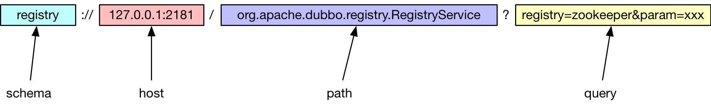
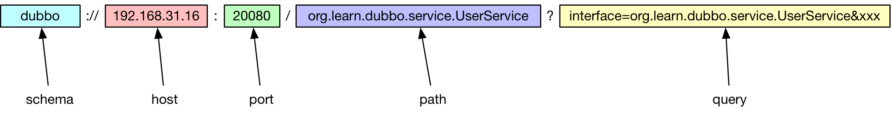
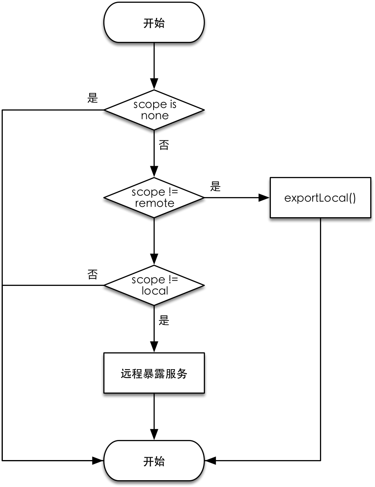
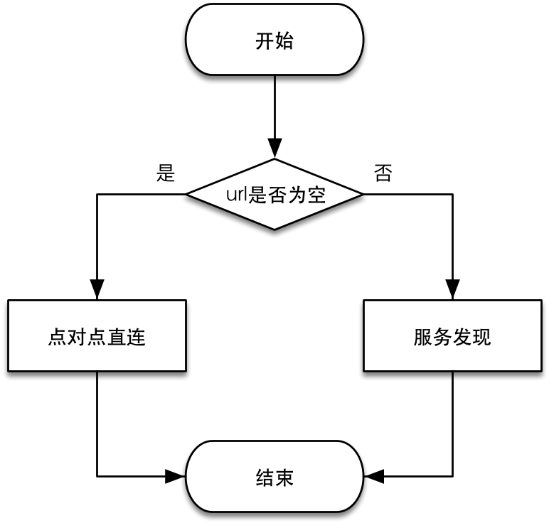
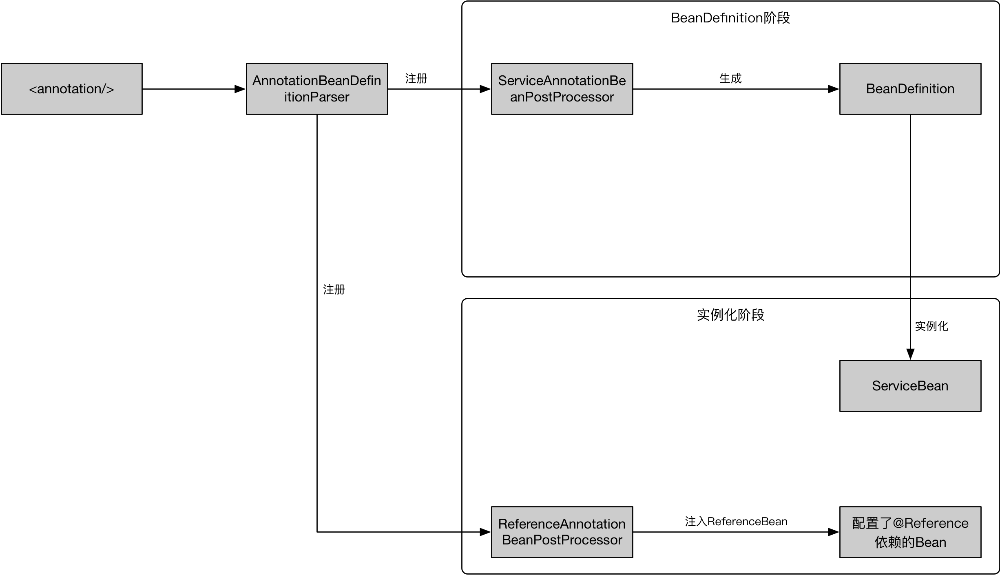

- [1.前言](https://tech101.cn/2020/02/16/Dubbo源码解析-服务暴露和引用#前言)
- [2.基于Java的服务暴露和引用](https://tech101.cn/2020/02/16/Dubbo源码解析-服务暴露和引用#基于java的服务暴露和引用)
- [2.1.服务暴露](https://tech101.cn/2020/02/16/Dubbo源码解析-服务暴露和引用#服务暴露)
- [2.2.服务引用](https://tech101.cn/2020/02/16/Dubbo源码解析-服务暴露和引用#服务引用)
- [3.基于Spring容器的服务暴露和引用](https://tech101.cn/2020/02/16/Dubbo源码解析-服务暴露和引用#基于spring容器的服务暴露和引用)
- [3.1.集成Spring框架](https://tech101.cn/2020/02/16/Dubbo源码解析-服务暴露和引用#集成spring框架)
- [3.2.NamespaceHandler](https://tech101.cn/2020/02/16/Dubbo源码解析-服务暴露和引用#namespacehandler)
- [3.3.基于XML配置](https://tech101.cn/2020/02/16/Dubbo源码解析-服务暴露和引用#基于xml配置)
- [3.4.基于注解](https://tech101.cn/2020/02/16/Dubbo源码解析-服务暴露和引用#基于注解)
- [4.总结](https://tech101.cn/2020/02/16/Dubbo源码解析-服务暴露和引用#总结)

## 前言

在远程调用过程中，远程调用的目标方法需要提供一个供远程调用方调用的入口；而发起远程调用的发起方也需要在本地创建一个代理对象来实现对远程方法的调用。Dubbo将提供远程调用目标的过程称为 **服务暴露**，而在调用发起方创建本地代理的过程称为 **服务引用**。

本文，我们将来分析Dubbo的服务暴露和引用的过程。在文章[《Dubbo源码解析——RPC实现原理》](https://tech101.cn/2020/02/01/Dubbo源码解析-RPC实现原理#服务引用和暴露)一文的中我们简要介绍了在RPC层面的服务引用和暴露，而本文我们将从应用层开始，自顶向下分析Dubbo完整的服务暴露和引用过程。

Dubbo提供了两种暴露和引用服务的方式：

- 基于Java API的服务暴露和引用
- 基于Spring容器的服务暴露和引用

下面，我们先来看下基于Java的服务暴露和引用是如何实现的。

## 基于Java的服务暴露和引用

### 服务暴露

基于Java的服务暴露方式，通过Dubbo的配置类`ServiceConfig`来实现服务的暴露。`ServiceConfig`的`export()`方法提供了服务暴露的起点。下面是一个简单的服务暴露的例子：

```
UserService impl = new UserServiceImpl();

ApplicationConfig applicationConfig = new ApplicationConfig(); // 1
applicationConfig.setName("simpleProvider");
applicationConfig.setCompiler("jdk");

RegistryConfig registryConfig = new RegistryConfig(); // 2
registryConfig.setAddress("zookeeper://127.0.0.1:2181");

ProtocolConfig protocolConfig = new ProtocolConfig(); // 3
protocolConfig.setName("dubbo");
protocolConfig.setPort(20080);
protocolConfig.setTransporter("netty3");

ServiceConfig<UserService> serviceConfig = new ServiceConfig<>(); // 4
serviceConfig.setApplication(applicationConfig);
serviceConfig.setRegistry(registryConfig);
serviceConfig.setProtocol(protocolConfig);
serviceConfig.setInterface(UserService.class);
serviceConfig.setRef(impl);
serviceConfig.setVersion("1.0.0");

serviceConfig.export(); // 5
```

1. 通过`ApplicationConfig`设置应用的配置信息，包括应用的名称、自适应组件的编译器等。
2. 配置服务注册中心，这里使用了zookeeper作为服务注册中心。
3. 配置服务通过什么协议暴露，这里配置服务以dubbo协议在端口`20080`上进行服务暴露，关于dubbo协议的暴露过程可以参考`DubboProtocol`的`export()`方法和[《Dubbo源码解析——RPC实现原理》](https://tech101.cn/2020/02/01/Dubbo源码解析-RPC实现原理#服务引用和暴露)文章中的关于服务引用和暴露部分的内容。
4. 聚合需要被暴露的服务的信息。
5. 通过调用`export()`方法开始服务暴露。

上面是服务通过Java API进行服务暴露的例子，我们可以看到服务最终是通过`export()`进行暴露的。下面，我们将顺着`export()`方法来一窥服务暴露的整个过程。

#### export( )

在`ServiceConfig`的`export()`方法中主要做两件事：一、检查启动配置是否正确；二、判断是否需要暴露以及是否需要进行延迟暴露。

```
public synchronized void export() {
    checkAndUpdateSubConfigs(); // 1

    if (!shouldExport()) { // 2
        return;
    }

    if (shouldDelay()) {
        DELAY_EXPORT_EXECUTOR.schedule(this::doExport, getDelay(), TimeUnit.MILLISECONDS); // 3
    } else {
        doExport(); // 4
    }
}

protected synchronized void doExport() { // 5
    if (unexported) {
        throw new IllegalStateException("The service " + interfaceClass.getName() + " has already unexported!");
    }
    if (exported) {
        return;
    }
    exported = true;

    if (StringUtils.isEmpty(path)) {
        path = interfaceName;
    }
    doExportUrls();
}
```

1. 检查服务暴露时配置的参数是否完整，包括默认参数的设置、注册中心配置检查（如果配置了注册中心的话）、被暴露的接口Class对象检查等。
2. 判断是否需要暴露服务，如果没有配置则默认暴露服务。
3. 判断是否需要延迟暴露，如果需要延迟暴露则将服务暴露过程打包成一个任务交由`ScheduledExecutorService`延迟执行。
4. 如果立即暴露，则调用`doExport()`进行服务暴露过程。
5. 在`doExport()`中检查当前的服务暴露状态，最终调用`doExportUrls`开始服务暴露。

下面我们来看下`doExportUrls()`的逻辑，在`doExportUrls()`中将会基于提供的注册中心配置进行服务的暴露。

```
复制private void doExportUrls() {
    List<URL> registryURLs = loadRegistries(true); // 1
    for (ProtocolConfig protocolConfig : protocols) { // 2
        String pathKey = URL.buildKey(getContextPath(protocolConfig).map(p -> p + "/" + path).orElse(path), group, version);
        ProviderModel providerModel = new ProviderModel(pathKey, ref, interfaceClass);
        ApplicationModel.initProviderModel(pathKey, providerModel);
        doExportUrlsFor1Protocol(protocolConfig, registryURLs); // 3
    }
}
```

1. 基于注册中心的配置`RegistryConfig`来加载表示注册中心配置的注册URL。Dubbo中关于配置信息的传递都是基于URL来实现的。
2. 由于Dubbo支持同时对多个协议进行服务暴露，所以这个会基于配置的`ProtocolConfig`，为服务在每个协议上进行暴露。
3. 调用`doExportUrlsFor1Protocol`进行服务暴露。

通过`loadRegistries()`从`registryConfig`生成的注册中心URL格式如下：



在URL的 **schema** 使用`registry`表示这是一个注册中心的URL。URL的 **host** 表示注册中心的主机地址。注册中心的URL的 **path** 部分是`org.apache.dubbo.registry.RegistryService`，最后Dubbo的配置信息通过URL的 **query** 参数进行拼接。在拼接 **query** 参数的时候，需要注意的是：方法`loadRegistries()`除了将Dubbo的配置信息放到 **query** 参数上之外，URL中还会把注册中心地址URL中的 **schema** 属性作为参数`registry`拼接到 **query** 中，用于表示使用哪种注册中心实现。比如在我们例子中会加上 `registry=zookeeper`。

上面例子中配置的`RegistryConfig`通过`loadRegistries()`会生成如下的注册URL：

```
registry://127.0.0.1:2181/org.apache.dubbo.registry.RegistryService
    ?application=simpleProvider
    &compiler=jdk
    &dubbo=2.0.2
    &pid=60377
    &registry=zookeeper
    &release=2.7.3
    &timestamp=1585009172197
```

#### doExportUrlsFor1Protocol( )

下面我们来看下如何在通过一个协议暴露服务。暴露服务的入口在`doExportUrlsFor1Protocol()`中。该方法中主要完成如下两件事：

1. 生成服务提供者URL（包含了服务提供者的所有配置信息）。
2. 使用生成的服务提供者URL暴露服务，并在配置的各个注册中心上注册服务。

首先生成服务提供者的URL，服务提供者的URL由5部分组成：



1. 协议头`schema`。协议头的值从协议配置类`ProtocolConfig`的`name`属性获取，表示服务将是用何种协议暴露，Dubbo支持多种协议扩展，比如`http`、`dubbo`、`hessian`等等，协议扩展的实现在Dubbo源码的`dubbo-rpc`模块中。在这里，我们的例子中使用了`dubbo`协议。
2. 服务提供者的主机地址`host`。
3. 服务提供者将要暴露的端口`port`。
4. 提供的服务的路径`path`。被暴露服务的全限定名作为服务的路径名。
5. 以URL查询语句编码的服务配置信息`query`。

```
dubbo://192.168.31.16:20080/org.learn.dubbo.service.UserService
    ?anyhost=true
    &application=simpleProvider
    &bind.ip=192.168.31.16
    &bind.port=20080
    &compiler=jdk
    &deprecated=false
    &dubbo=2.0.2
    &dynamic=true
    &generic=false
    &interface=org.learn.dubbo.service.UserService
    &methods=getUser
    &pid=75231
    &register=true
    &release=2.7.3
    &revision=1.0.0
    &side=provider
    &timestamp=1585400579650
    &transporter=netty3
    &version=1.0.0
```

生成服务提供者的URL以后，接下来就可以基于这个URL上编码的配置信息进行服务暴露了。首先，通过判断`scope`的配置值来决定是远程暴露还是本地暴露。



1. 如果值为`local`则表示只进行本地暴露。
2. 如果值为`remote`则进行远程暴露。
3. 如果值为`none`则不进行服务暴露。
4. 如果值既不是`local`也不是`remote`则既在本地暴露也在远程暴露。

下面是具体的代码实现：

```
private void doExportUrlsFor1Protocol(ProtocolConfig protocolConfig, List<URL> registryURLs) {
  /* 省略 */
  if (!SCOPE_NONE.equalsIgnoreCase(scope)) {
      if (!SCOPE_REMOTE.equalsIgnoreCase(scope)) {
          exportLocal(url); // 1
      }
      if (!SCOPE_LOCAL.equalsIgnoreCase(scope)) {
          if (!isOnlyInJvm() && logger.isInfoEnabled()) {
              logger.info("Export dubbo service " + interfaceClass.getName() + " to url " + url);
          }
          if (CollectionUtils.isNotEmpty(registryURLs)) { // 2
              for (URL registryURL : registryURLs) {
                  //if protocol is only injvm ,not register
                  if (LOCAL_PROTOCOL.equalsIgnoreCase(url.getProtocol())) {
                      continue;
                  }
                  url = url.addParameterIfAbsent(DYNAMIC_KEY, registryURL.getParameter(DYNAMIC_KEY));
                  URL monitorUrl = loadMonitor(registryURL);
                  if (monitorUrl != null) {
                      url = url.addParameterAndEncoded(MONITOR_KEY, monitorUrl.toFullString());
                  }
                  if (logger.isInfoEnabled()) {
                      logger.info("Register dubbo service " + interfaceClass.getName() + " url " + url + " to registry " + registryURL);
                  }

                  // For providers, this is used to enable custom proxy to generate invoker
                  String proxy = url.getParameter(PROXY_KEY);
                  if (StringUtils.isNotEmpty(proxy)) {
                      registryURL = registryURL.addParameter(PROXY_KEY, proxy);
                  }

                  Invoker<?> invoker = PROXY_FACTORY.getInvoker(ref, (Class) interfaceClass, registryURL.addParameterAndEncoded(EXPORT_KEY, url.toFullString())); // 3
                  DelegateProviderMetaDataInvoker wrapperInvoker = new DelegateProviderMetaDataInvoker(invoker, this);

                  Exporter<?> exporter = protocol.export(wrapperInvoker); // 4
                  exporters.add(exporter);
              }
          } else { // 5
              Invoker<?> invoker = PROXY_FACTORY.getInvoker(ref, (Class) interfaceClass, url);
              DelegateProviderMetaDataInvoker wrapperInvoker = new DelegateProviderMetaDataInvoker(invoker, this);

              Exporter<?> exporter = protocol.export(wrapperInvoker);
              exporters.add(exporter);
          }
          
          /* 省略 */
      }
  }
  /* 省略 */
}
```

1. 通过`exportLocal()`在本地暴露服务，本地暴露是一种特殊的服务暴露，服务的URL中的协议头为`injvm`，在`exportLocal()`会将`url`的协议头转换成`injvm`。本地暴露的服务在调用的时候不会进行网络通信，而是在同一个JVM内部进行服务调用，类似于方法调用，只不过是将方法调用转换成了Dubbo`Invoker`的`invoke()`调用。
2. 如果配置了注册中心，则遍历所有配置的注册中心，在每个注册中心上注册服务。
3. 将Java暴露的服务转换成`Invoker`对象。关于`Invoker`和被暴露的服务之间的关系可以参考[Invoker转换](https://tech101.cn/2020/02/01/Dubbo源码解析-RPC实现原理#方法调用向invoker转换)。在这里要注意，传给`getInvoker()`方法的是URL是注册中心的URL，而真正被暴露的服务的URL则作为注册中心URL的参数`export`被传递给了生成的`Invoker`对象，这么做的原因是考虑到Dubbo注册中心的实现方式，这里我们先不展开，等分析服务注册的时候我们再回过头来看这个问题。
4. 调用`Protocol`的`export()`方法进行服务暴露，基于配置的不同服务暴露协议，会调用不同的`Protocol`实现来进行服务暴露。在我们的例子中，`export()`最终会调用`DubboProtocol`的`export()`方法进行dubbo协议的服务暴露，在dubbo协议的`export()`方法中，会在服务提供方的机器上启动一个服务端，接收来自服务消费方的请求。关于dubbo协议的服务暴露细节可以参考[Dubbo协议服务暴露](https://tech101.cn/2020/02/01/Dubbo源码解析-RPC实现原理#暴露)。不过在调用`DubboProtocol`暴露服务之前，Dubbo会进行服务注册过程，关于服务注册的细节我们暂时先不展开。
5. 如果没有配置注册中心的配置，则只进行服务暴露，这个过程不会进行服务注册。

到这里差不多就介绍了Dubbo的服务提供者如何通过基于Java API的配置方式进行服务暴露的。关于具体协议的服务暴露细节，可以参考`dubbo-rpc`包中的具体实现，对于Dubbo协议的服务暴露，可以参考[这里](https://tech101.cn/2020/02/01/Dubbo源码解析-RPC实现原理#服务引用和暴露)，在这里我们就不再展开。下面，我们来看下Dubbo基于Java的服务引用过程。

### 服务引用

基于Java的Dubbo服务引用过程通过`ReferenceConfig`配置类来实现。服务引用的入口在`ReferenceConfig`的`get()`方法里，下面是基于Java的服务引用的一个简单例子：

```
ApplicationConfig applicationConfig = new ApplicationConfig(); // 1
applicationConfig.setCompiler("jdk");
applicationConfig.setName("simpleConsumer");

RegistryConfig registryConfig = new RegistryConfig(); // 2
registryConfig.setAddress("zookeeper://127.0.0.1:2181");

ReferenceConfig<UserService> referenceConfig = new ReferenceConfig<>(); // 3
referenceConfig.setApplication(applicationConfig);
referenceConfig.setRegistry(registryConfig);
referenceConfig.setInterface(UserService.class); // 3
referenceConfig.setVersion("1.0.0");
referenceConfig.setClient("netty3");

UserService userService = referenceConfig.get(); // 4
```

1. 通过`ApplicationConfig`配置服务消费方的应用。
2. 设置注册中心，用于服务发现。这里使用了Zookeeper作为注册中心。
3. 配置需要引用的服务的信息，这里通过配置`ReferenceConfig`对象来指定服务消费方需要引用哪个服务。通过`setInterface()`方法指定服务提供方提供的接口类对象。
4. 调用`get()`方法执行服务引用逻辑。

#### get( )方法

```
public synchronized T get() {
    checkAndUpdateSubConfigs(); // 1

    if (destroyed) {
        throw new IllegalStateException("The invoker of ReferenceConfig(" + url + ") has already destroyed!");
    }
    if (ref == null) { // 2
        init(); // 2
    }
    return ref;
}
```

1. 在引用服务前检查Dubbo的配置。
2. 判断是否已经引用过服务，如果没有则调用`init()`方法初始化。

`init()`初始化方法主要做了如下三件事：

1. 初始化服务消费方的引用配置。
2. 判断连接服务提供方的方式是P2P还是服务发现。
3. 创建被引用服务的代理对象。

#### 初始化引用配置

```
private void init() {
    if (initialized) {
        return;
    }
    checkStubAndLocal(interfaceClass); // 1
    checkMock(interfaceClass); // 1
    Map<String, String> map = new HashMap<String, String>();

    map.put(SIDE_KEY, CONSUMER_SIDE); // 2

    appendRuntimeParameters(map); // 3
    if (!isGeneric()) {
        String revision = Version.getVersion(interfaceClass, version); // 4
        if (revision != null && revision.length() > 0) {
            map.put(REVISION_KEY, revision);
        }

        String[] methods = Wrapper.getWrapper(interfaceClass).getMethodNames(); // 5
        if (methods.length == 0) {
            logger.warn("No method found in service interface " + interfaceClass.getName());
            map.put(METHODS_KEY, ANY_VALUE);
        } else {
            map.put(METHODS_KEY, StringUtils.join(new HashSet<String>(Arrays.asList(methods)), COMMA_SEPARATOR));
        }
    }
    map.put(INTERFACE_KEY, interfaceName);
    appendParameters(map, metrics);
    appendParameters(map, application);
    appendParameters(map, module);
    // remove 'default.' prefix for configs from ConsumerConfig
    // appendParameters(map, consumer, Constants.DEFAULT_KEY);
    appendParameters(map, consumer);
    appendParameters(map, this);
    Map<String, Object> attributes = null;
    if (CollectionUtils.isNotEmpty(methods)) {
        attributes = new HashMap<String, Object>();
        for (MethodConfig methodConfig : methods) {
            appendParameters(map, methodConfig, methodConfig.getName());
            String retryKey = methodConfig.getName() + ".retry";
            if (map.containsKey(retryKey)) {
                String retryValue = map.remove(retryKey);
                if ("false".equals(retryValue)) {
                    map.put(methodConfig.getName() + ".retries", "0");
                }
            }
            attributes.put(methodConfig.getName(), convertMethodConfig2AyncInfo(methodConfig));
        }
    }

    String hostToRegistry = ConfigUtils.getSystemProperty(DUBBO_IP_TO_REGISTRY); // 6
    if (StringUtils.isEmpty(hostToRegistry)) {
        hostToRegistry = NetUtils.getLocalHost();
    } else if (isInvalidLocalHost(hostToRegistry)) {
        throw new IllegalArgumentException("Specified invalid registry ip from property:" + DUBBO_IP_TO_REGISTRY + ", value:" + hostToRegistry);
    }
    map.put(REGISTER_IP_KEY, hostToRegistry);

    ref = createProxy(map); // 7

    String serviceKey = URL.buildKey(interfaceName, group, version);
    ApplicationModel.initConsumerModel(serviceKey, buildConsumerModel(serviceKey, attributes));
    initialized = true;
}
```

1. 检查服务提供方的Jar包中是否存在stub和mock类。
2. 设置`side`配置为`consumer`，表示配置的是服务消费方。
3. 将JVM的运行时信息写入配置信息。
4. 获取接口Jar包的版本。
5. 通过反射获取引用的接口的方法列表。
6. 如果JVM所在的主机有多个网卡，则通过`DUBBO_IP_TO_REGISTRY`属性指定连接到注册中心的客户端IP地址，如果没有配置则通过`InetAddress.getLocalHost()`获取第一个合法的本地IP地址。IP地址值设置在`register.ip`属性中。
7. 创建服务提供方远程服务的代理对象。

在`createProxy()`中包含了连接注册中心进行服务发现和通过动态代理创建远程服务代理对象的逻辑，我们先来看下Dubbo是如何判断连接远程服务的方式的。

#### 引用服务的方式

Dubbo如果配置了注册中心，则通过注册中心进行服务发现来获取服务提供方的主机地址，然后用这个主机地址和服务提供方创建远程连接。当然，Dubbo也可以不使用服务发现的能力，通过直连服务提供方的方式调用远程服务，只需要在引用服务的时候配置远程服务的地址就可以了。下面我们来看下代码是如何做的：

```
private T createProxy(Map<String, String> map) {
    if (shouldJvmRefer(map)) { // 1
        URL url = new URL(LOCAL_PROTOCOL, LOCALHOST_VALUE, 0, interfaceClass.getName()).addParameters(map);
        invoker = REF_PROTOCOL.refer(interfaceClass, url);
        if (logger.isInfoEnabled()) {
            logger.info("Using injvm service " + interfaceClass.getName());
        }
    } else {
        urls.clear(); 
        if (url != null && url.length() > 0) { // 2
            String[] us = SEMICOLON_SPLIT_PATTERN.split(url);
            if (us != null && us.length > 0) {
                for (String u : us) {
                    URL url = URL.valueOf(u);
                    if (StringUtils.isEmpty(url.getPath())) {
                        url = url.setPath(interfaceName);
                    }
                    if (REGISTRY_PROTOCOL.equals(url.getProtocol())) {
                        urls.add(url.addParameterAndEncoded(REFER_KEY, StringUtils.toQueryString(map)));
                    } else {
                        urls.add(ClusterUtils.mergeUrl(url, map));
                    }
                }
            }
        } else { // 3
            if (!LOCAL_PROTOCOL.equalsIgnoreCase(getProtocol())){
                checkRegistry();
                List<URL> us = loadRegistries(false); // 3
                if (CollectionUtils.isNotEmpty(us)) {
                    for (URL u : us) {
                        URL monitorUrl = loadMonitor(u);
                        if (monitorUrl != null) {
                            map.put(MONITOR_KEY, URL.encode(monitorUrl.toFullString()));
                        }
                        urls.add(u.addParameterAndEncoded(REFER_KEY, StringUtils.toQueryString(map))); // 3
                    }
                }
                if (urls.isEmpty()) {
                    throw new IllegalStateException("No such any registry to reference " + interfaceName + " on the consumer " + NetUtils.getLocalHost() + " use dubbo version " + Version.getVersion() + ", please config <dubbo:registry address=\"...\" /> to your spring config.");
                }
            }
        }
        /* 省略 */
    }
}
```

1. 判断是否需要引用本地JVM中的服务。如果指定了端到端的配置（设置了`url`属性），则默认引用的是远程服务；如果没有设置`url`属性，则通过配置里的`scope`属性来判断是否需要引用本地JVM中的服务。如果`scope`的值为`local`或者`injvm`的配置值为`true`则表示引用本地JVM中的服务；如果`score`的值为`remote`则表示引用的是远程服务。最后，如果`scope`的值未设置，则通过判断本地已经`export()`的服务列表中是否有被引用的服务，如果有则也进行本地引用。
2. 检查配置值`url`是否为空，`url`的值用于指定端到端的服务提供方地址。如果`url`不为空则表示不进行服务发现，进行端到端的服务连接。
3. 通过注册中心进行服务发现。通过使用注册中心来进行服务发现，和服务注册一样，需要初始化注册中心的地址，并且在注册中心的URL中设置服务引用的配置信息，配置信息设置在`refer`属性上。下面是例子中生成的注册中心的URL地址，其中`refer`属性上包含了通过URL的 **query** 格式编码的配置信息。

```
registry://127.0.0.1:2181/org.apache.dubbo.registry.RegistryService
    ?application=simpleConsumer
    &compiler=jdk
    &dubbo=2.0.2
    &pid=257
    &refer=
        application=simpleConsumer
        &client=netty3
        &compiler=jdk
        &dubbo=2.0.2
        &interface=org.learn.dubbo.service.UserService
        &lazy=false
        &methods=getUser
        &pid=257
        &register.ip=192.168.31.16
        &release=2.7.3
        &revision=1.0.0
        &side=consumer
        &sticky=false
        &timestamp=1586005659063
        &version=1.0.0
    &registry=zookeeper
    &release=2.7.3
    &timestamp=1586005674684
```

#### 创建代理对象

有了配置信息以后，接下来就是调用`Protocol`的`refer()`方法创建`Invoker`对象，然后使用动态代理技术生成一个远程服务的动态代理对象。对这个动态代理对象中的方法的调用都会被转换到对`Invoker`的调用。

```
private T createProxy(Map<String, String> map) {
    if (shouldJvmRefer(map)) {
      /* 省略 */
    } else {
      /* 省略 */
        if (urls.size() == 1) {
            invoker = REF_PROTOCOL.refer(interfaceClass, urls.get(0)); // 1
        } else { // 1
            List<Invoker<?>> invokers = new ArrayList<Invoker<?>>();
            URL registryURL = null;
            for (URL url : urls) {
                invokers.add(REF_PROTOCOL.refer(interfaceClass, url));
                if (REGISTRY_PROTOCOL.equals(url.getProtocol())) {
                    registryURL = url; // use last registry url
                }
            }
            if (registryURL != null) { // registry url is available
                // use RegistryAwareCluster only when register's CLUSTER is available
                URL u = registryURL.addParameter(CLUSTER_KEY, RegistryAwareCluster.NAME);
                // The invoker wrap relation would be: RegistryAwareClusterInvoker(StaticDirectory) -> FailoverClusterInvoker(RegistryDirectory, will execute route) -> Invoker
                invoker = CLUSTER.join(new StaticDirectory(u, invokers));
            } else { // not a registry url, must be direct invoke.
                invoker = CLUSTER.join(new StaticDirectory(invokers));
            }
        }
    }
    /* 省略 */
    // create service proxy
    return (T) PROXY_FACTORY.getProxy(invoker); // 2
}
```

1. 判断远程服务地址有多少个，如果只有一个远程服务地址，则直接调用`Protocol`的`refer()`方法创建`Invoker`对象。入股有多个远程服务地址，则需要引入集群管理。这里需要注意的是，`urls`中包含的的地址可能是一个服务提供方的地址（端到端的场景），也可能是一个注册中心的地址（Dubbo会将注册中心伪装成一个`Invoker`，这部分涉及到Dubbo集群的内容，这里不展开）。
2. 通过代理工厂生产动态代理类。关于动态代理类和`Invoker`之间的关系，可以参考[这里](https://tech101.cn/2020/02/01/Dubbo源码解析-RPC实现原理#方法调用向invoker转换)。



关于`Protocol`中引用服务的逻辑，不同的协议实现都不同。在`dubbo-rpc`模块中可以找到对应协议的服务引用实现，我们在[这里](https://tech101.cn/2020/02/01/Dubbo源码解析-RPC实现原理#引用)介绍了Dubbo协议是如何在RPC这一层引用服务的：通过创建和服务提供方的TCP长连接来向服务提供方发起远程调用。

## 基于Spring容器的服务暴露和引用

Dubbo支持对Spring框架的深度集成，通过Spring的Bean容器管理服务的暴露和引用。Dubbo提供了两种暴露和引用服务的方案：

1. 基于Spring XML配置的服务暴露和引用。
2. 基于注解的服务暴露和引用。

接下来，我们来看下Dubbo是如何和Spring框架进行集成的。

### 集成Spring框架

Dubbo为基于Spring XML配置的服务暴露和发现功能提供了一套自定义的XML标签，下面就是一个服务暴露和发现的XML配置：

```
<!-- dubbo-export.xml -->
<?xml version="1.0" encoding="UTF-8"?>
<beans xmlns="http://www.springframework.org/schema/beans"
       xmlns:xsi="http://www.w3.org/2001/XMLSchema-instance"
       xmlns:dubbo="http://dubbo.apache.org/schema/dubbo"
       xsi:schemaLocation="http://www.springframework.org/schema/beans http://www.springframework.org/schema/beans/spring-beans.xsd
       http://dubbo.apache.org/schema/dubbo/dubbo.xsd">

    <dubbo:application name="simpleProvider" compiler="jdk"/>
    <dubbo:registry address="zookeeper://127.0.0.1:2181"/>
    <dubbo:protocol name="dubbo" port="20080" transporter="netty3"/>
    <dubbo:service id="userService" interface="org.learn.dubbo.service.UserService" ref="userServiceImpl"/>

    <!-- spring bean -->
    <bean id="userServiceImpl" class="org.learn.dubbo.service.UserServiceImpl"/>
</beans>

<!-- dubbo-reference.xml -->
<?xml version="1.0" encoding="UTF-8"?>
<beans xmlns="http://www.springframework.org/schema/beans"
       xmlns:xsi="http://www.w3.org/2001/XMLSchema-instance"
       xmlns:dubbo="http://dubbo.apache.org/schema/dubbo"
       xsi:schemaLocation="http://www.springframework.org/schema/beans http://www.springframework.org/schema/beans/spring-beans.xsd
       http://dubbo.apache.org/schema/dubbo/dubbo.xsd">

    <dubbo:application name="simpleConsumer" compiler="jdk"/>
    <dubbo:registry address="zookeeper://127.0.0.1:2181"/>
    <dubbo:reference id="userServiceImpl" interface="org.learn.dubbo.service.UserService"/>
</beans>
```

在上面的XML配置中，Dubbo提供了一套自定义的XML标签，这些标签定义在`http://dubbo.apache.org/schema/dubbo/dubbo.xsd`中。

- `<dubbo:application/>`
- `<dubbo:registry/>`
- `<dubbo:reference/>`
- `<dubbo:service/>`
- `<dubbo:protocol/>`

这些标签和Spring提供的`<bean/>`标签不同，默认情况下上面的这些标签Spring框架是识别不了的，那么Dubbo是如何将这套自定义的标签和Spring框架集成的呢？实际上Dubbo是利用了Spring提供的XML配置名字空间扩展机制`NamespaceHandler`。

### NamespaceHandler

Spring框架提供了一个支持自定义名字空间的扩展点，使用Spring框架的开发者只要自定义实现`NamespaceHandler`就可以将自定义标签的解析逻辑集成到Spring容器的启动过程中，在读取XML配置文件的时候提供自定义标签的解析。具体细节可以参考[Spring官方文档](https://docs.spring.io/spring-framework/docs/current/spring-framework-reference/core.html#xml-custom)

下面是Dubbo提供的`DubboNamespaceHandler`，它实现了Spring框架的`NamespaceHandler`接口：

```
public class DubboNamespaceHandler extends NamespaceHandlerSupport {
    @Override
    public void init() {
        registerBeanDefinitionParser("application", new DubboBeanDefinitionParser(ApplicationConfig.class, true)); // 1
        registerBeanDefinitionParser("module", new DubboBeanDefinitionParser(ModuleConfig.class, true)); // 1
        registerBeanDefinitionParser("registry", new DubboBeanDefinitionParser(RegistryConfig.class, true)); // 1
        registerBeanDefinitionParser("config-center", new DubboBeanDefinitionParser(ConfigCenterBean.class, true)); // 1
        registerBeanDefinitionParser("metadata-report", new DubboBeanDefinitionParser(MetadataReportConfig.class, true)); // 1
        registerBeanDefinitionParser("monitor", new DubboBeanDefinitionParser(MonitorConfig.class, true)); // 1
        registerBeanDefinitionParser("metrics", new DubboBeanDefinitionParser(MetricsConfig.class, true)); // 1
        registerBeanDefinitionParser("provider", new DubboBeanDefinitionParser(ProviderConfig.class, true)); // 1
        registerBeanDefinitionParser("consumer", new DubboBeanDefinitionParser(ConsumerConfig.class, true)); // 1
        registerBeanDefinitionParser("protocol", new DubboBeanDefinitionParser(ProtocolConfig.class, true)); // 1
        registerBeanDefinitionParser("service", new DubboBeanDefinitionParser(ServiceBean.class, true)); // 2
        registerBeanDefinitionParser("reference", new DubboBeanDefinitionParser(ReferenceBean.class, false)); // 3
        registerBeanDefinitionParser("annotation", new AnnotationBeanDefinitionParser()); // 4
    }
}
```

1. 注册自定义的XML标签，比如`<dubbo:application/>`、`<dubbo:module/>`、`<dubbo:protocol/>`等。当Spring容器在启动的时候解析XML配置的时候识别到了这些自定义的标签，就会调用提供的`BeanDefinitionParser`实现`DubboBeanDefinitionParser`对这些标签进行解析，生成对应的`BeanDefinition`并将这个Bean定义注册到容器。在Spring容器的实例化阶段会生基于这些`BeanDefinition`生成Bean实例对象。
2. 识别`<dubbo:service/>`标签，并生成`ServiceBean`这个类对应的`BeanDefinition`，当容器启动以后会生成`ServiceBean`的Bean实例。`ServiceBean`是`ServiceConfig`的子类，负责在Spring容器中暴露服务。
3. 识别`<dubbo:reference/>`标签，生成`RefercenceBean`这个类对应的`BeanDefinition`。和`ServiceBean`的作用一样，`ReferenceBean`是`ReferenceConfig`的子类，负责在Spring容器中引用服务。
4. 解析`<dubbo:annotation/>`标签，用于支持基于注解的服务暴露和发现。

### 基于XML配置

XML配置中的自定义标签通过注册的`DubboBeanDefinitionParser`解析器进行处理。`DubboBeanDefinitionParser`解析器会解析XML元素，然后生成对应的`BeanDefinition`对象并注册到容器中，容器在实例化Bean阶段会将对应的`BeanDefinition`实例化成Bean对象。

基于Java的配置中创建的`ApplicationConfig`、`RegistryConfig`、`ProtocolConfig`以及`ServiceConfig`对象，在XML配置中都是由Spring容器创建的。通过`DubboNamespaceHandler`解析自定义的标签，生成这些类的`BeanDefinition`实例，然后由Spring容器生成对应的配置对象。其中用于Java API中服务暴露的`ServiceConfig`类，对应的Bean对象就是`ServiceBean`，而`ReferenceConfig`对应的是`ReferenceBean`对象。


#### ServiceBean

`ServiceBean`是`ServiceConfig`的子类，所以`ServiceBean`的服务暴露过程和我们上面分析`ServiceConfig`的服务暴露过程一样。但是触发服务暴露的时机却不同，在基于Java API的服务暴露过程中，通过在代码中直接调用`ServiceConfig`的`export()`方法触发服务暴露逻辑；而在`ServiceBean`中，由于Bean的创建过程是由容器负责的，我们没有通过写代码暴露服务的时机，所以Spring容器管理的`ServiceBean`，在触发服务暴露的时候是通过容器提供的事件驱动或生命周期回调函数实现的。

当容器创建完成`ServiceBean`对象以后，会执行Bean的生命周期函数。`ServiceBean`实现了`InitializingBean`接口，通过实现`afterPropertiesSet()`来完成配置的检查和初始化过程。配置初始化完成以后，通过判断`supportedApplicationListener`是否为`true`来决定是否需要调用`export()`方法执行服务暴露。

```
public void afterPropertiesSet() throws Exception {
    /* 省略 */
    if (!supportedApplicationListener) {
        export();
    }
}
```

如果`supportedApplicationListener`为`false`，则Dubbo需要采用事件驱动的方式进行服务暴露。Dubbo的`ServiceBean`实现了`ApplicationListener<ContextRefreshedEvent>`接口，通过监听容器启动过程中派发的容器启动完成事件`ContextRefreshedEvent`来触发服务暴露的逻辑。

```
@Override
public void onApplicationEvent(ContextRefreshedEvent event) {
    if (!isExported() && !isUnexported()) {
        if (logger.isInfoEnabled()) {
            logger.info("The service ready on spring started. service: " + getInterface());
        }
        export();
    }
}
```

#### ReferenceBean

和`ServiceBean`类似，`ReferenceBean`也是`ReferenceConfig`的子类。不过不同于`ServiceBean`，`ReferenceBean`是一个`BeanFactory`工厂对象。当调用`BeanFactory`的`getObject()`的时候会调用`ReferenceConfig`的`get()`方法执行服务引用逻辑。

```
@Override
public Object getObject() {
    return get();
}
```

### 基于注解

Dubbo提供了`@Service`和`@Reference`两个注解用于在Spring容器中暴露服务和引用服务。只要在容器的XML配置文件中配置自定义标签`<dubbo:annotation/>`，Spring在解析到这个自定标签的时候会调用在`DubboNamespaceHandler`中注册的`AnnotationBeanDefinitionParser`解析器。

```
public class AnnotationBeanDefinitionParser extends AbstractSingleBeanDefinitionParser {
  @Override
  protected void doParse(Element element, ParserContext parserContext, BeanDefinitionBuilder builder) {

      String packageToScan = element.getAttribute("package");

        String[] packagesToScan = trimArrayElements(commaDelimitedListToStringArray(packageToScan));

      builder.addConstructorArgValue(packagesToScan);

      builder.setRole(BeanDefinition.ROLE_INFRASTRUCTURE);

      // Registers ReferenceAnnotationBeanPostProcessor
      registerReferenceAnnotationBeanPostProcessor(parserContext.getRegistry());
  }
  
  private void registerReferenceAnnotationBeanPostProcessor(BeanDefinitionRegistry registry) { // 2
      // Register @Reference Annotation Bean Processor
      BeanRegistrar.registerInfrastructureBean(registry,
              ReferenceAnnotationBeanPostProcessor.BEAN_NAME, ReferenceAnnotationBeanPostProcessor.class);
  }

  @Override
  protected Class<?> getBeanClass(Element element) {
      return ServiceAnnotationBeanPostProcessor.class;
  }
}
```

`AnnotationBeanDefinitionParser`首先会生成一个`ServiceAnnotationBeanPostProcessor`类的`BeanDefinition`，`ServiceAnnotationBeanPostProcessor`是一种`BeanFactoryPostProcessor`后置处理器。`BeanFactoryPostProcessor`是Spring容器提供的一个扩展点，允许使用Spring容器的开发人员自定义Bean实例化前对Bean的定义进行前置和后置操作，Dubbo基于注解的服务暴露就是在这个阶段自动扫描指定的包路径下的所有类，看是否有`@Service`注解，如果有注解则会自动生成并注册对应的`BeanService`类的`BeanDefinition`对象，在后续实例化阶段会生成这些被暴露服务的`ServiceBean`实例。后面暴露的流程则和上面提到的基于XML的服务暴露的一样，这里不再赘述。包路径是通过在`<dubbo:annotation/>`中的`package`参数指定的。

不过在`AnnotationBeanDefinitionParser`只生产了用于处理`@Service`的`BeanDefinition`，而处理`@Reference`的后置处理器`ReferenceAnnotationBeanPostProcessor`则是在`doParse()`中另外注册的（见代码点2）。

`ReferenceAnnotationBeanPostProcessor`也是一个后置处理器，不过不同于`ServiceAnnotationBeanPostProcessor`，它是一个`BeanPostProcessor`类型的类。`BeanPostProcessor`不同于`BeanFactoryPostProcessor`，它是在实例化完成以后才执行的后置处理器，所以`ReferenceAnnotationBeanPostProcessor`在处理服务引用的方式上和`ServiceAnnotationBeanPostProcessor`还有点区别。

首先，`@Reference`是设置在成员变量或对应的Setter方法上的（`@Service`作用在类上），用于将远程服务注入到依赖的Bean中，所以可以认为`@Reference`是和`@Autowire`类似的一种特殊依赖注入方式。`ReferenceAnnotationBeanPostProcessor`继承了Spring中用于实现注解注入的`AnnotationInjectedBeanPostProcessor`抽象类，用于实现基于注解的自定义依赖注入逻辑。

```
public class ReferenceAnnotationBeanPostProcessor extends AnnotationInjectedBeanPostProcessor implements
        ApplicationContextAware, ApplicationListener {
          /* 省略 */
    @Override
    protected Object doGetInjectedBean(AnnotationAttributes attributes, Object bean, String beanName, Class<?> injectedType,
                                       InjectionMetadata.InjectedElement injectedElement) throws Exception {

        String referencedBeanName = buildReferencedBeanName(attributes, injectedType);

        ReferenceBean referenceBean = buildReferenceBeanIfAbsent(referencedBeanName, attributes, injectedType); // 1

        registerReferenceBean(referencedBeanName, referenceBean, attributes, injectedType); // 2

        cacheInjectedReferenceBean(referenceBean, injectedElement);

        return buildProxy(referencedBeanName, referenceBean, injectedType); // 3
    }
    
    /* 省略 */
}
```

1. 生成`ReferenceBean`对象。
2. 将生成的`ReferenceBean`对象注册到Spring容器中。
3. 为`ReferenceBean`生成一个动态代理类，在`createProxy()`中会判断引用的服务是否在Spring容器中（引用在本地暴露的服务），如果在的话会跳过服务引用过程，直接将引用的服务注入到Bean中，源码见下方：

```
private Object buildProxy(String referencedBeanName, ReferenceBean referenceBean, Class<?> injectedType) {
    InvocationHandler handler = buildInvocationHandler(referencedBeanName, referenceBean);
    return Proxy.newProxyInstance(getClassLoader(), new Class[]{injectedType}, handler);
}

private InvocationHandler buildInvocationHandler(String referencedBeanName, ReferenceBean referenceBean) {

    ReferenceBeanInvocationHandler handler = localReferenceBeanInvocationHandlerCache.get(referencedBeanName);

    if (handler == null) {
        handler = new ReferenceBeanInvocationHandler(referenceBean);
    }

    if (applicationContext.containsBean(referencedBeanName)) { // Is local @Service Bean or not ?
        // ReferenceBeanInvocationHandler's initialization has to wait for current local @Service Bean has been exported.
        localReferenceBeanInvocationHandlerCache.put(referencedBeanName, handler);
    } else {
        // Remote Reference Bean should initialize immediately
        handler.init();
    }

    return handler;
}

private static class ReferenceBeanInvocationHandler implements InvocationHandler {

    private final ReferenceBean referenceBean;

    private Object bean;

    private ReferenceBeanInvocationHandler(ReferenceBean referenceBean) {
        this.referenceBean = referenceBean;
    }

    @Override
    public Object invoke(Object proxy, Method method, Object[] args) throws Throwable {
        Object result;
        try {
            if (bean == null) { // If the bean is not initialized, invoke init()
                // issue: https://github.com/apache/dubbo/issues/3429
                init();
            }
            result = method.invoke(bean, args);
        } catch (InvocationTargetException e) {
            // re-throws the actual Exception.
            throw e.getTargetException();
        }
        return result;
    }

    private void init() {
        this.bean = referenceBean.get();
    }
}
```



## 总结

本文介绍了Dubbo在应用层暴露和引用服务的过程。介绍了基于Java API的服务暴露和服务引用的实现原理；介绍了Dubbo是如何和Spring框架集成，利用Spring框架提供的扩展能力来实现基于容器的服务暴露和引用。